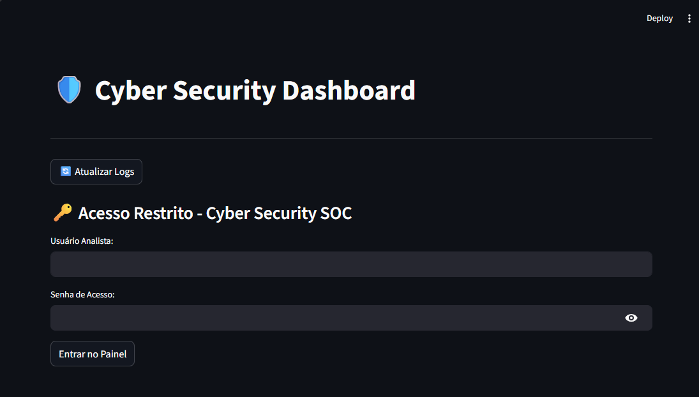
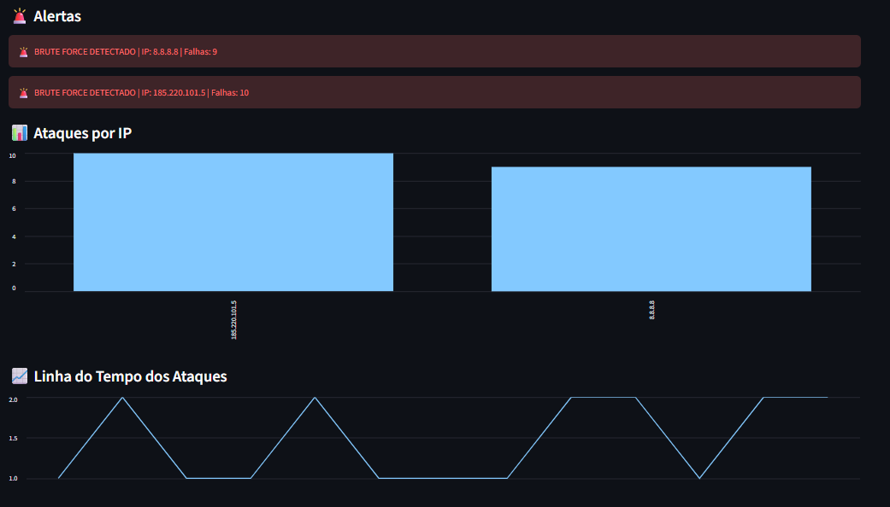
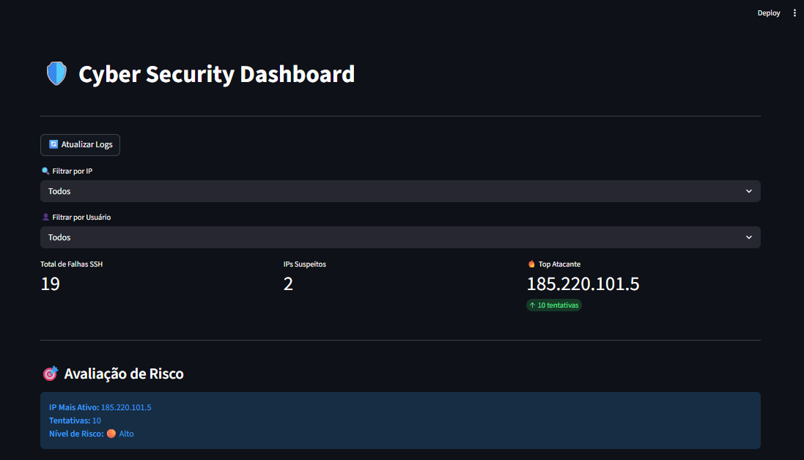
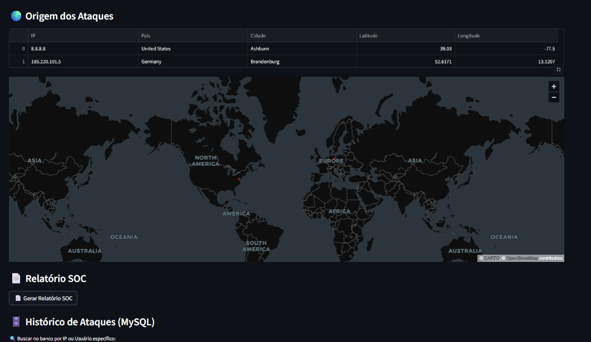
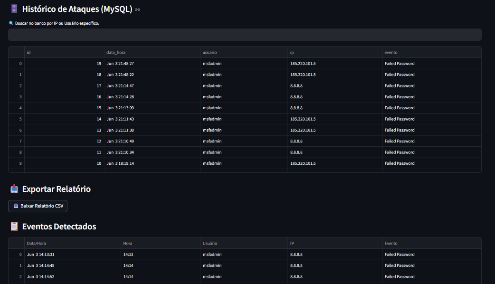

# 🛡️ Brute Force Monitor & SIEM Dashboard

Dashboard interativo de monitoramento, correlação de eventos e detecção de ataques de força bruta (*Brute Force*) em serviços SSH.

A aplicação funciona como uma solução **mini-SIEM (Security Information and Event Management)** integrada a um banco de dados relacional, permitindo coletar, armazenar, correlacionar e visualizar eventos de segurança em tempo real.

O projeto simula um cenário de SOC (*Security Operations Center*), onde logs de autenticação Linux (`auth.log`) gerados por ataques controlados são processados, armazenados em banco de dados e transformados em inteligência visual para análise de ameaças.

---

## 🎯 Objetivo

Demonstrar na prática conceitos de:

- Defesa Cibernética
- Segurança de Aplicações (AppSec)
- Engenharia de Dados
- Monitoramento de Eventos de Segurança
- Banco de Dados Relacional
- Desenvolvimento Seguro

### Principais tópicos abordados

- Parsing estruturado de logs com Regex.
- Modelagem e persistência de dados com MySQL.
- Mitigação de SQL Injection através de queries parametrizadas.
- Gestão segura de credenciais com Secrets Management.
- Observabilidade e auditoria utilizando logging.
- Controle de acesso por autenticação.

---

## 🏗️ Arquitetura do Projeto

```text
[ Kali Linux ]
      │
      ▼
Tentativas de acesso SSH
      │
      ▼
[ Metasploitable 2 ]
      │
      ▼
Geração de logs (auth.log)
      │
      ▼
[ Aplicação Python ]
      │
      ├── Parsing dos logs
      ├── Correlação de eventos
      ├── Parametrização de consultas SQL
      ├── Sistema de autenticação
      ├── Geolocalização de IPs
      └── Logging de auditoria
      │
      ▼
[ Banco de Dados MySQL ]
      │
      ▼
[ Dashboard Streamlit ]
      │
      ├── Métricas de segurança
      ├── Alertas de brute force
      ├── Mapa geográfico de ataques
      ├── Gráficos e tendências
      └── Consulta histórica de eventos
       │
       ▼
## 📸 Screenshots

    ### Acesso_SOC
     

    ### Dashboard Principal
    

    ### Cyber Dashboard
    

    ### Origem Relatorio
    

     ### Historico
     